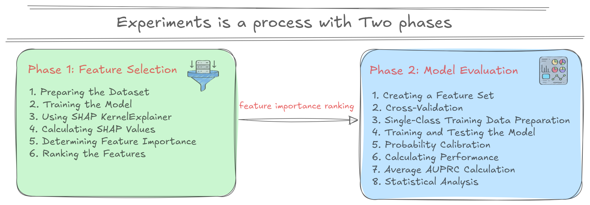

# BLG 527E Lesson Project Codes: Model-Agnostic Feature Selection Technique to Improve the Performance of One-Class Classifiers study implementation

The method of the study was implemented as a two-phase process.



### Phase 1: Feature Selection
SHAP (SHapley Additive exPlanations) values to rank feature importance, which is particularly valuable for understanding which features contribute most to anomaly detection. 

* Using One-Class SVM and GMM as base models for feature importance calculation
* Employing KernelExplainer with 100 samples for computational efficiency
* Averaging absolute SHAP values across samples to determine feature importance rankings

The choice to exclude the "time" feature makes sense for fraud detection, as temporal patterns might not generalize well across different time periods.

### Phase 2: Model Evaluation
* The 10 repetitions of 5-fold cross-validation (50 total evaluations per configuration) provides strong statistical reliability for results.
* AUPRC is indeed more suitable than ROC-AUC for imbalanced datasets like credit card fraud, as it better captures performance on the minority class.
* Including sigmoid calibration is crucial for obtaining meaningful probability estimates from One-Class SVM, which typically outputs decision scores rather than probabilities.
* Using ANOVA followed by Tukey's HSD test ensures you can make statistically valid conclusions about optimal feature set sizes.

### Implementation Details:
```
* Fixed hyperparameters (nu=0.0025, gamma=0.0310 for SVM; n_components=2 for GMM)
* Feature subset testing with [3, 5, 7, 10, 15, 29] features

Phase 1 - Feature Selection:

Uses SHAP KernelExplainer with 100 samples
Trains on normal data only (Class == 0)
Calculates feature importance by averaging absolute SHAP values
Ranks features from highest to lowest importance

Phase 2 - Model Evaluation:

Implements 10 repetitions of 5-fold cross-validation (50 total evaluations)
Removes anomalies from training data while keeping them in test sets
Uses logistic regression for probability calibration
Calculates AUPRC for each fold

Statistical Analysis:

Performs ANOVA test with alpha=0.01
Conducts Tukey's HSD test if ANOVA is significant
Provides comprehensive summary statistics

```

### Example Usage
``` python
# Simple usage
detector = CreditCardFraudDetection()
results = detector.run_complete_analysis('creditcard.csv')

# Or run step by step
detector.load_and_prepare_data('creditcard.csv')
detector.phase1_feature_selection('svm')
detector.phase2_model_evaluation('svm')
detector.statistical_analysis('svm')
```

### Project Structure
```
.
├── dataset # dataset used in the study
│   ├── __init__.py
│   └── creditcard.csv
├── docs # report & paper
├── img  # images
├── src
│   ├── anomaly_detection # credit cart anomaly detection
│   └── models # one class GMM implementation
├── tests
│   ├── __init__.py
│   └── phase1.py # unit test
├── .gitignore
├── Dockerfile
├── main.py # main file to run experiment
├── README.md
├── requirements.txt
```

### Running Code
``` bash

Option 1: Using Docker Compose 
# Build and run the analysis
docker-compose up --build

Option 2: Local execution
# Install dependencies
pip install -r requirements.txt

# Run the analysis
python main.py
```
